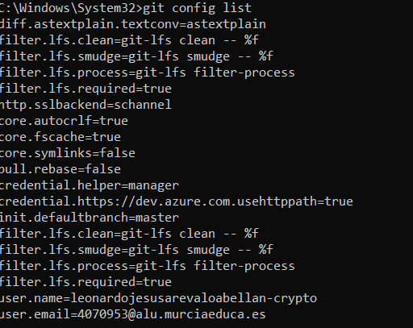
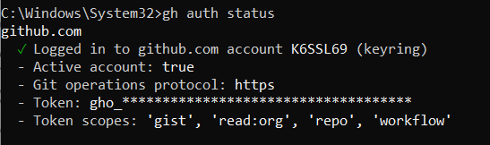
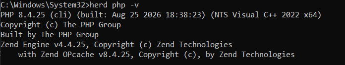
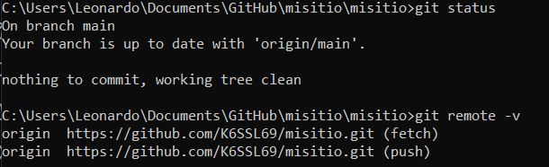
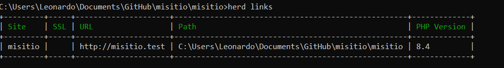

# Práctica 01

# 1. Git instalado y configurado en local

He instalado y configurado Git en local, y para comprobarlo uso el siguiente comando:

```cmd
git config list
```



---

# 2. GitHub CLI instalado y configurado

He instalado y configurado GitHub CLI para trabajar con GitHub desde la
terminal, y para comprobar que está correctamente autenticado uso el
siguiente comando:

``` cmd
gh auth status
```



# 3. Herd instalado con PHP 8.4

He instalado Herd y configurado PHP 8.4 para utilizarlo como entorno de
desarrollo local. Para comprobar la versión de PHP uso el siguiente
comando:

``` cmd
herd php -v
```



# 4. Repositorio "misitio" clonado en local

He clonado el repositorio `misitio` en local para poder trabajar con el
proyecto desde el equipo. Para comprobar la conexión con el repositorio
remoto uso el siguiente comando:

``` cmd
git remote -v
```



# 5. Herd enlazado al repositorio "misitio" y HTTPS

He enlazado el repositorio `misitio` con Herd para poder ejecutarlo
desde el entorno local y acceder al sitio mediante HTTPS. Para comprobar
los proyectos enlazados con Herd uso el siguiente comando:

``` cmd
herd links
```



# 6. Elementos y plugins utilizados en Read the Docs

Para realizar la documentación se ha utilizado Markdown junto con Read
the Docs.

Los principales elementos utilizados son:

-   Títulos y subtítulos para organizar el contenido.
-   Bloques de código para mostrar los comandos utilizados.
-   Imágenes para añadir las capturas de pantalla.
-   Texto para explicar cada apartado.